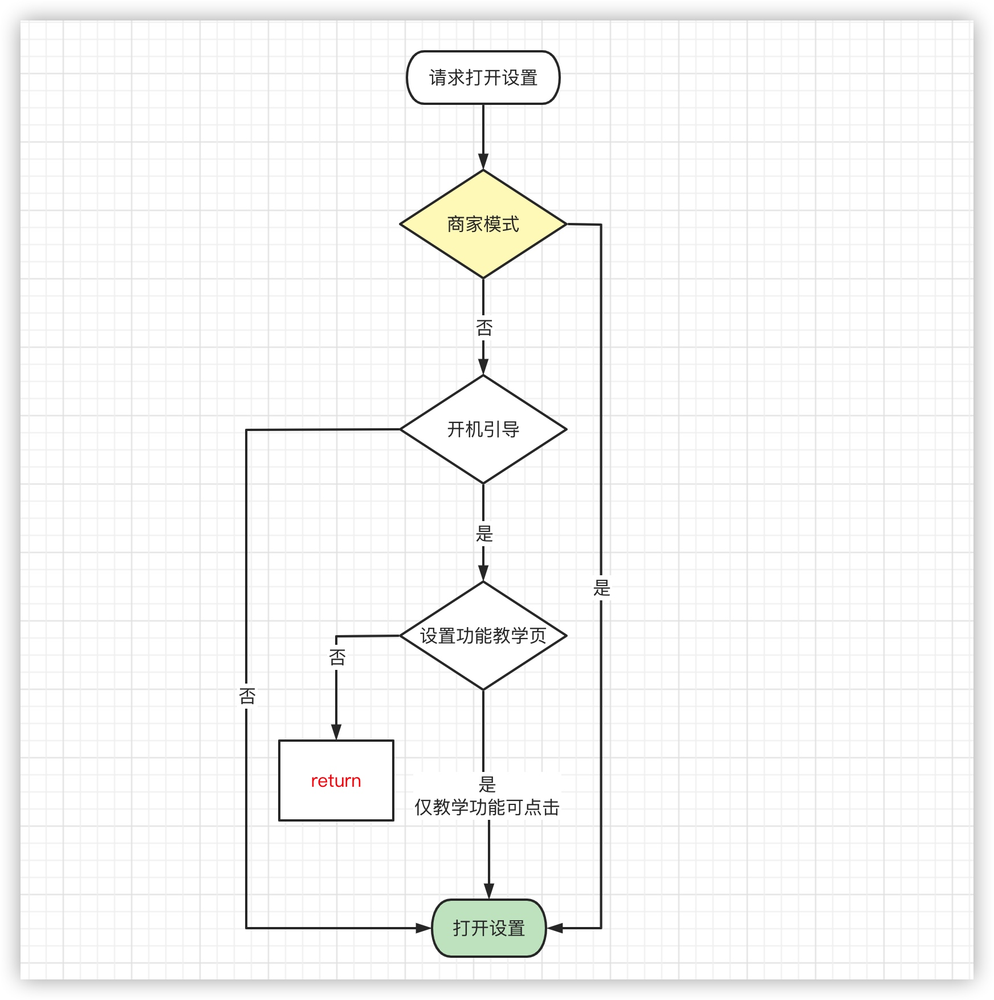

# 设置打开以及功能控制逻辑——6.0

```
//判断开机引导是否结束 1：结束；0：未结束
fun parseGuide(): Int {
    return SystemProperties.getInt("persist.jmgo.guide.complete",0)
}
//判断是否处于开机引导设置功能演示界面 1：是；0：否
fun parseGuideHelp(): Int {
    return SystemProperties.getInt("persist.jmgo.guide.help",0)
}
//os6.0 判断商家模式 true:是； false:否
fun parseShopMode6(): Boolean {
    return SystemProperties.getBoolean("jmgo.os.shop_probation_mode", false)
}
//os5.0 判断商家模式 true:是； false:否
fun parseShopMode5(): Boolean {
    return SystemProperties.getBoolean("persist.sys.jmgo_shop_probation_mode", false)
}
```



